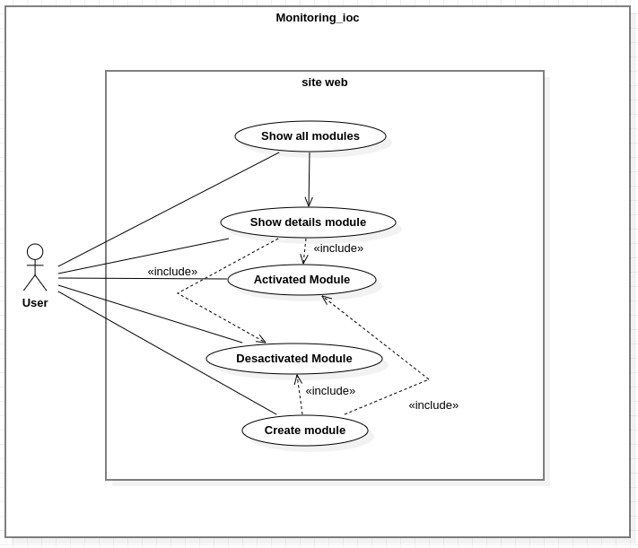
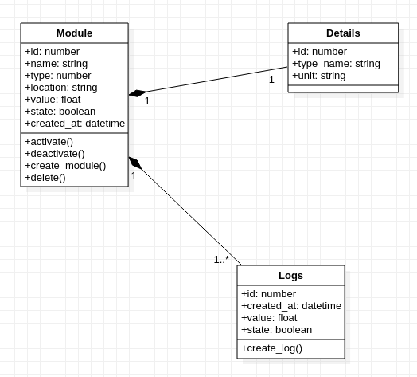
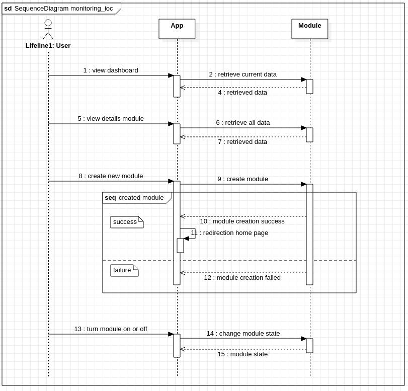

<h1 align="center">Welcome to Webreathe Monitoring ioc 👋</h1>
<p>
  
</p>

> You have just applied for a company specializing in automated counting in public transport. 
> You are put to a test to set yourself apart from other applicants.
> For several years, objects connected to the Internet have multiplied, however the tools to check their operation and their availability remain rare. 
> Your mission is to design a web platform for monitoring IOT modules.

## On the command line

### 1️⃣ Project recovery
------
```sh
git@github.com:mocquaischristopher/webreathe_monitoring_ioc.git
```
Enter the project folder : 
```sh
cd testWebreathe/monitoring_ioc
```

### 2️⃣ Install missing dependencies
------
Those are the dependencies to note in file .gitignore

```sh
npm install
```

### 3️⃣ Create database 
------
You have to create the database on the command line so that the project can start

### 4️⃣ Create .env file in folder root of project and configure
------
It is necessary to create this file and to configure it in order to make the relation with the BDD otherwise the project will not work.
With file .env.example for make file .env

```sh
PORT=3333
HOST=0.0.0.0
NODE_ENV=development
APP_KEY=********************** (to note in file .env.example)
DRIVE_DISK=local
SESSION_DRIVER=cookie
CACHE_VIEWS=false

DB_CONNECTION=pg
PG_HOST=localhost
PG_PORT=5432
PG_USER=userOfDatabase
PG_PASSWORD=**********
PG_DB_NAME=nameOfDatabaseCreateJustBefore
```


### 5️⃣ Make migrations 
------

This allows you to create tables and columns in the database

```sh
node ace migration:run

```
### 6️⃣ Run the seed command
------

This allows you to add the data in the correponding tables.
The data of the tables is in the file seed with the name of the table corresponding.
The file MainSeeder decides the order of launching the seeds files.
```sh
node ace db:seed
```
### 7️⃣ last etape
------

You can run the project with the next command :

```sh
npm run dev
```
then go to the following address in your browser :

```sh
localhost:3333
```
------


## Conception

  * Usecase diagram: 
  
  

  * Class diagram:
  

  * Sequence diagram:
  


  8️⃣ The project is run 🆗 ⭐, good fun 👍 .


## Author

👤 [**MocquaisChristopher**](https://github.com/mocquaischristopher) 

## Link of Jira
https://mocquaischristopher.atlassian.net/jira/software/projects/WM/boards/1/roadmap
## Show your support

Give a ⭐️ if this project helped you!

***
_This README was generated with ❤️ by [readme-md-generator](https://github.com/kefranabg/readme-md-generator)_
